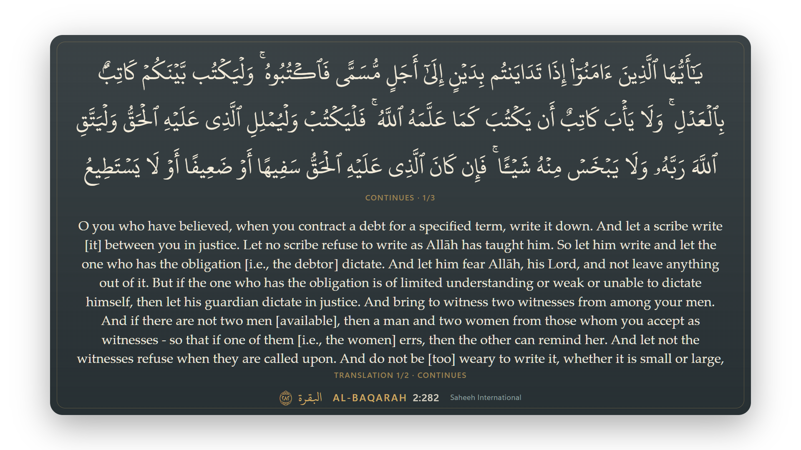

# Quran Overlay

A local web display for Quran recitation: large Uthmani Arabic with the Saheeh International English underneath, for a full-screen reading screen in the browser or an OBS/Twitch overlay. It can follow a reciter from the microphone and be navigated by typed or spoken English ("2:255", "Surah Maryam ayah 3", "the verse about hardship and ease").

All **6,236 ayahs in all 114 surahs** are included and validated. It is not a chatbot, generates no scripture, translation or commentary, and never shows model-authored text.



## Run it

Requires Node 22.12+ (developed on Node 24 LTS; see `.nvmrc`) and Chrome or Edge.

```bash
npm install
```

```bash
npm run corpus:import -- --manifest corpus/sources.json
```

```bash
npm run build
```

```bash
npm start
```

`corpus:import` reads the research pack in `work/` (not committed), checks every source hash and writes `data/processed/` (not committed). `npm start` serves on `http://127.0.0.1:4317` (or the next free port) and prints a **private control link** (`/control#owner=…`). Open it in Chrome/Edge; the capability is swapped for an HttpOnly cookie and removed from the address bar. The server only listens on loopback.

For development with hot reload: `npm run dev` (backend + Vite on `http://127.0.0.1:5173`; open the printed control link with port 5173).

### Listening and decisions (optional keys)

Copy `.env.example` to `.env` and fill in what you have. Nothing else is read from other projects.

| Variable | Needed for |
|---|---|
| `SONIOX_API_KEY` | Following recitation from the microphone. The server mints a single-use 60-second temporary key per stream; the long-lived key never reaches the browser. |
| `JEV_PROVIDER` + `TYPESAFE_API_KEY` or `OPENROUTER_API_KEY` | Optional JEV decisions for ambiguous places and English search selection. Only the selected gateway is called. |
| `TRACKER_MODE` | `hybrid` (default), `deterministic`, or `jev_required` (experiment). Also switchable on the control page. |

Without keys, everything except listening works: manual and keyboard navigation, typed English references and meaning search, the reading screen and the overlay.

## Use it in the browser first

- **Reading screen:** *Stream output → Open reading screen* opens the same display with a solid background; make it full-screen (F11) on a second monitor.
- **Go to an ayah:** type `2:255`, `surah two verse two hundred fifty five`, `yaseen`, `al kahf verse 10`, `next`, or describe the meaning. References show immediately; meaning searches stay private until you choose **Show on stream** on a result card (following pauses so recitation can't override your choice; **Resume following** continues from there). *Hold to speak a request* does the same by voice (needs Soniox).
- **Three different actions:** *Stop listening* keeps the current ayah on screen. *Pause following* freezes the screen while still listening. *Hide from stream* blanks the audience view without losing your place.
- **Keyboard:** ← / → previous/next ayah, H pause/resume, B hide/unhide.
- **Long ayahs** that cannot fit legibly are paged, never shrunk or clipped: the Arabic part follows the recitation position; translation pages turn on a timer or with ›. A lower third that cannot hold an ayah is shown full frame for that ayah, and the control page says so.

## OBS

Sources → + → Browser, paste the link from **Copy OBS overlay link**, set width 1920 and height 1080. Leave "Shutdown source when not visible" off so scene switches don't reconnect it (both settings recover: every (re)connect receives the full current state). The overlay link can only display verses; **Replace overlay link** revokes it. The overlay plays no audio. Keep the microphone in the Chrome/Edge control page, not in OBS.

## How it works

```text
Control page (Chrome/Edge) ── mic → Soniox (temporary key) → tokens ─┐
                                                                    ▼
Local server: transcript assembly → tracker (full-corpus retrieval + bounded alignment)
             → optional JEV decision (shortlist + WAIT, revalidated) → one display state
                                                                    │ WebSocket (revisioned)
                      overlay / reading screen / control preview ◄──┘
```

- `src/shared/contracts.ts` is the single owner of every wire message and the display state.
- `src/server/tracker/` — normalization, full-corpus index, alignment, candidate generation, reducer (proposals, uncertainty, collisions), scheduler (single flight, newest pending, deadline, negative cache), follower (modes, evidence binding, revalidation). No React or network dependency; usable by other apps.
- `src/server/providers/` — Soniox key minting; JEV Decisions clients for TypeSafe direct and OpenRouter with strict response validation.
- `src/server/search/`, `src/server/commands/` — reference/number parsing, chapter aliases derived from corpus names, BM25 over the translation, optional semantic adapter, command resolution.
- `src/web/` — control page, overlay/reading screen, and one shared `VerseDisplay` renderer that measures real line boxes before paint.
- `src/shared/display-encoding.ts` — see *Known limitations*.

## Commands

| Command | What it does |
|---|---|
| `npm run corpus:import -- --manifest corpus/sources.json` | Verify source hashes, build and validate the processed corpus and copy the font. Writes nothing if any check fails. |
| `npm run corpus:validate` | Re-check the processed corpus (25 checks: 114 surahs, Hafs verse map, exact key sets, basmala rules incl. 1:1, 9:1 and 27:30, disjoint-letter openings, markup, UTF-8, hashes, font coverage). |
| `npm test` | 91 unit and integration tests (tracker, transcript, JEV validation, scheduler, follower modes, server authorization, commands, push-to-talk lane, capture). |
| `npm run test:ui` | Builds, starts a server on port 4399 and runs the browser walkthrough in installed Edge. |
| `npm run typecheck` | TypeScript check. |
| `npm run replay -- --fixture <path> --mode <mode>` | Replay a scenario (`fixtures/scenarios/*.json`) or a capture (`.jsonl`) through the real follower. |
| `npm run benchmark -- --manifest fixtures/benchmark.json` | All fixtures × three modes → `docs/BENCHMARK.md`. |
| `npm run eval:english` | 50 English requests (28 held out) → `docs/ENGLISH_EVAL.md`. |
| `npm run search:embed` | Optional semantic-search experiment; downloads a model — see below. |

Set `QO_DIAGNOSTIC_CAPTURE=1` to write recognized text tokens (never audio) to `data/captures/*.jsonl`, bounded at 20 MB, in the replay format. Off by default.

## What has and has not been verified

| Evidence layer | Status |
|---|---|
| Source and tests | 91 tests + typecheck + production build pass. |
| Corpus | 25/25 validation checks; all 6,236 ayahs present in display, search and English with matching keys. |
| Replay (synthetic) | 19 hand-authored scenarios over real corpus text, three modes: deterministic 0 wrong displays, 168/178 ayahs shown; hybrid identical with a *simulated* decider; jev_required 0 wrong but slower (see `docs/BENCHMARK.md`). Streams use assumed provider timing and error rates. |
| Browser | Playwright walkthrough in Edge (control page + separate reading screen): privacy of search, show/pause/resume, hide/unhide, paging, lower-third promotion, reload recovery. Frames reviewed visually. |
| Soniox live recognition | **Not verified** — no `SONIOX_API_KEY` was available. SDK integration follows the installed `@soniox/client` 2.3.0 declarations. |
| JEV decisions | **Not verified live** — no TypeSafe/OpenRouter key. Validated against transport fixtures only; no Arabic accuracy claim. |
| Microphone → screen latency | **Not measured.** Replay onset→display figures use assumed timing. Measured: tracker compute p95 ≈ 3.5 ms per update on this machine; commit→paint round trip is instrumented on the control page. |
| OBS rendering | **Not verified** in OBS. The overlay is the same page verified in Edge. |

## Known limitations

- **Display text/font pairing.** The display text is Quran.com Uthmani; the font is KFGQPC Uthmanic Hafs (QUL font 245), which is built for QPC-Hafs encoding. Rendered directly, every silent-letter mark (U+06DF, 3,988 occurrences) appears as a detached dotted circle. `display-encoding.ts` maps the three affected marks to the codepoints this font draws (verified against QUL's own QPC-Hafs text for the 1,923 verses in the development dump, and visually). One mark remains unrenderable: U+06E3 in 52:37. Tanween and ya forms follow the Uthmani source rather than QPC print conventions. Importing QUL resource 86 (QPC-Hafs text) would remove the mapping.
- **Rights.** The QUL code licence does not cover the translation or font. Terms for the Saheeh International translation, Quran.com text and KFGQPC font were **not checked**; `corpus/sources.json` marks every source "local use only". Check before publishing or redistributing.
- **Footnotes.** Saheeh footnote markers are removed from the display; footnote bodies are not in the local corpus (their ids are kept).
- **Word highlighting** is off: Imlaei (search) and Uthmani (display) word counts differ in 628 ayahs, so no validated word mapping exists.
- **Basmala:** a recited basmala alone is ambiguous (1:1, 27:30 and the unnumbered basmala before 112 surahs); the tracker waits for the next words rather than guessing.
- **Semantic search** is not set up. `npm run search:embed` requires `npm install @huggingface/transformers` and downloads Xenova/all-MiniLM-L6-v2 (~23 MB) from huggingface.co; its benefit is unmeasured.
- The tracker's thresholds are engineering starting values tuned only on synthetic streams; they need real reciters and the user's microphone before they can be called calibrated.

More: `docs/REUSE_NOTES.md` (what was carried over from Moard and Nur, and how it is verified here), `docs/BENCHMARK.md`, `docs/ENGLISH_EVAL.md`, and the research/plan in `outputs/`.
