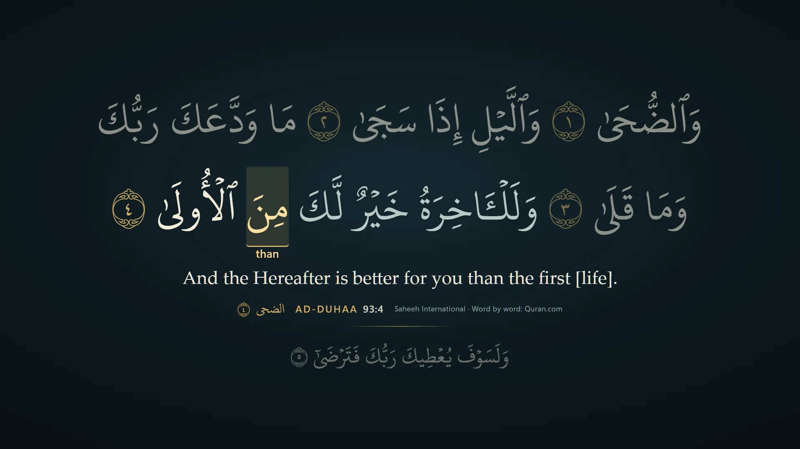
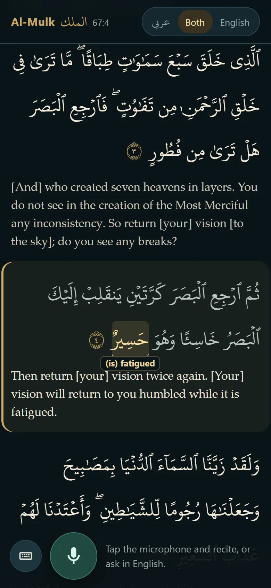
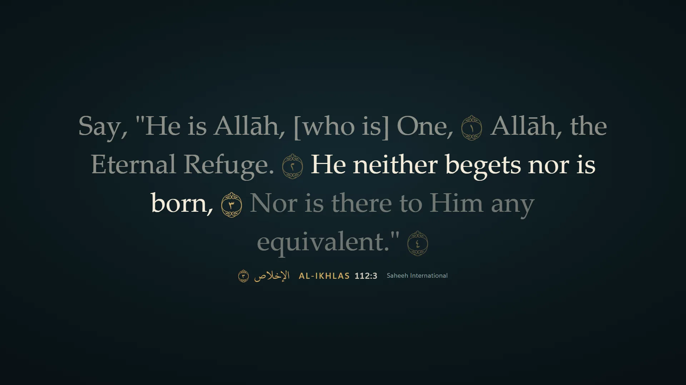
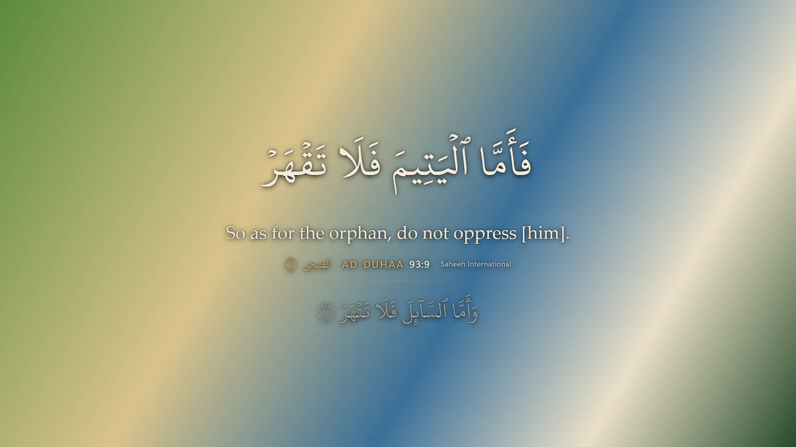

# Quran Overlay

**Recite, and the Quran follows you.** Open it, tap the microphone and recite any surah: the ayah you are reciting appears in large Uthmani script with the English translation, the word you are on lights up with its meaning underneath, and the page moves with you. Talk to it in plain English: "go to Surah Maryam, ayah three", "surah about elephants", "show the ayah about the orphan", "English only".

It works as a personal reader on your phone or computer, and as an OBS/Twitch overlay for streamed recitation. All **6,236 ayahs in all 114 surahs**, validated against the Hafs verse map. It never generates scripture, translation or commentary.

<p>
  
  
</p>

## What it does

- **Follows recitation fast.** About one second from the start of an ayah to it being on screen (median 0.9–1.0 s, measured end to end through the real microphone path and Soniox), with **zero wrong ayahs** across 58 test scenarios and the recorded sessions. Word-by-word highlighting as you recite, a heads-up when you reach an ayah's last word, and the next ayah waiting dimmed below.
- **Understands how people actually recite.** Speech-recognition word splits ("ولا الآخرة" for "وللآخرة"), a basmala before a surah, one-word openings ("والضحى", "يس"), plainly read (unmelodic) recitation, and ayahs named by their sound in English letters ("go to inna fatahna").
- **Talk to it.** English requests are recognised while you recite and never disturb following: references, surah names (asking when names are close, never guessing), natural-language finding ("surah about elephants" opens Al-Fil), and display commands ("Arabic only", "word by word", "pause", "hide").
- **Reads beautifully.** Short ayahs share the screen as one mushaf-style passage; long ayahs are paged, never shrunk; Arabic + English, Arabic only, or English only; word-by-word meanings; ornaments, reduced-motion support, legible over any stream footage.
- **Free, with an optional hosted service.** Run it yourself with your own keys, unlimited. The hosted mode gives every visitor their own session and a free monthly allowance of listening time; reading and search are always free (see [docs/DEPLOY.md](docs/DEPLOY.md)).

<p>
  
  
</p>

## Run it yourself

Requires Node 22.13+ (developed on Node 24) and Chrome or Edge.

```bash
npm install
```

```bash
npm run corpus:fetch
```

```bash
npm run corpus:import -- --manifest corpus/sources.json
```

```bash
npm run wbw:import
```

```bash
npm run build
```

```bash
npm start
```

`corpus:fetch` downloads the Quran text, translation, chapter table and font from their public sources and refuses any file that does not match the SHA-256 pinned in `corpus/sources.json`; `corpus:import` builds and validates the corpus (25 checks); `wbw:import` adds word-by-word meanings and transliterations (Quran.com). Nothing licensed is committed to this repository.

`npm start` serves on `http://127.0.0.1:4317` and prints a **private control link**. Open it in Chrome or Edge, or change `/control` to `/reader` in that link for the phone-friendly reader. Copy `.env.example` to `.env` and add `SONIOX_API_KEY` to follow recitation (and `OPENROUTER_API_KEY` for spoken requests and meaning search); without keys, reading, navigation, search and the overlay all work.

To host it for others, see [docs/DEPLOY.md](docs/DEPLOY.md) (Docker, HTTPS proxy, free allowances, optional payments, costs) and the short path in [docs/LAUNCH.md](docs/LAUNCH.md).

## Use it in your own app

The follower and the finder are plain TypeScript with no server or keys required. [examples/follow.ts](examples/follow.ts) shows both, after the corpus steps above:

```bash
npx tsx examples/follow.ts
```

```ts
const r = await resolver.resolve('surah about elephants', null);   // -> candidates, first card 105:1

session.onDisplay((d) => console.log(d.verse?.key, d.cursor?.from)); // ayah and word being recited
session.handle({ type: 'capture', captureEpoch: 1, event: 'recording' });
session.handle({ type: 'transcript', captureEpoch: 1, seq: 0, receivedAt: 0,
  tokens: [{ text: 'قل هو الله احد', isFinal: true }] });              // words from any recogniser
```

Feed it the words your speech recogniser hears (final and in-progress tokens, with timings if you have them) and it reports the ayah and word being recited, the same engine that drives the reader and overlay. Its output is references (`112:1`, word 4); take the Arabic and translation from their publisher (for example the [Quran.com API](https://api-docs.quran.com)) under its terms. There is no npm package or hosted API yet; open an issue if you need one.

## Privacy

Audio goes from the browser directly to Soniox (speech recognition) only while the microphone is on, using a short-lived key. The server never receives or stores audio, writes no request logs, and in hosted mode keeps no transcripts. During a long pause (8 s without voice) nothing is sent: the stream to Soniox closes, and a new one opens the moment you recite again (the microphone stays on locally in between). Listening stops by itself after a minute without recitation, or three minutes during such a pause.

## Attribution

Arabic text (Uthmani and Imlaei), Saheeh International translation, chapter metadata, word-by-word meanings and transliterations: [Quran.com](https://quran.com) API v4 (Quran Foundation). Saheeh International is published by Dar Abul-Qasim. Font: KFGQPC Uthmanic Script HAFS, King Fahd Glorious Quran Printing Complex (free to use and distribute; not to be sold or modified). Speech recognition: [Soniox](https://soniox.com). Decisions: JEV via OpenRouter.

## License

The code is [MIT licensed](LICENSE). The Quran text, translation, word-by-word data and font are not part of this repository and are not covered by that license: `npm run corpus:fetch` and `npm run wbw:import` download them from their publishers, whose terms apply (see *Attribution*).

---

The sections below are for contributors: how following works, commands, and what has been verified.

## Development

For development with hot reload: `npm run dev` (backend + Vite on `http://127.0.0.1:5173`; open the printed control link with port 5173).

### Listening and decisions (optional keys)

Copy `.env.example` to `.env` and fill in what you have. Nothing else is read from other projects.

| Variable | Needed for |
|---|---|
| `SONIOX_API_KEY` | Following recitation from the microphone. The server mints a single-use 60-second temporary key per stream; the long-lived key never reaches the browser. |
| `JEV_PROVIDER` + `TYPESAFE_API_KEY` or `OPENROUTER_API_KEY` | Optional JEV decisions for ambiguous places and English search selection. Only the selected gateway is called. |
| `TRACKER_MODE` | `hybrid` (default), `deterministic`, or `jev_required` (experiment). Also switchable on the control page. |

Without keys, everything except listening works: manual and keyboard navigation, typed English references and meaning search, the reading screen and the overlay.

## Use it in the browser first

- **Reading screen:** *Stream output → Open reading screen* opens the same display with a solid background; make it full-screen (F11) on a second monitor.
- **Recite or ask:** one microphone for both. Recite and the screen follows; say or type `2:255`, `surah two verse two hundred fifty five`, `yaseen`, `go to inna fatahna`, `surah about elephants`, `English only`, `next`. References and explicit finding requests show immediately; plain descriptions of a verse stay private until you choose **Show on stream** on a result card.
- **Going back and moving on:** restarting a few words back after a breath (or at the start of the ayah) is followed, not treated as a new place. When recitation stops matching (a jump elsewhere, a pause to talk), the last ayah stays up until the new place is found; *When recitation stops matching → clear the screen after 3 s* is the alternative.
- **Three different actions:** *Stop listening* keeps the current ayah on screen. *Pause following* freezes the screen while still listening. *Hide from stream* blanks the audience view without losing your place.
- **Keyboard:** ← / → previous/next ayah, H pause/resume, B hide/unhide.
- **Long ayahs** that cannot fit legibly are paged, never shrunk or clipped: the Arabic part follows the recitation position; translation pages turn on a timer or with ›. A lower third that cannot hold an ayah is shown full frame for that ayah, and the control page says so.

## OBS

Sources → + → Browser, paste the link from **Copy OBS overlay link**, set width 1920 and height 1080. Leave "Shutdown source when not visible" off so scene switches don't reconnect it (both settings recover: every (re)connect receives the full current state). The overlay link can only display verses; **Replace overlay link** revokes it. The overlay plays no audio. Keep the microphone in the Chrome/Edge control page, not in OBS.

## How it works

```text
Control page (Chrome/Edge) ── mic → Soniox (temporary key) → tokens ─┐
                                                                    ▼
Local server: transcript assembly → tracker (full-corpus retrieval + bounded alignment)
             → optional JEV decision (shortlist + WAIT, revalidated) → one display state
                                                                    │ WebSocket (revisioned)
                      overlay / reading screen / control preview ◄──┘
```

- `src/shared/contracts.ts` is the single owner of every wire message and the display state.
- `src/server/tracker/` — normalization, full-corpus index, alignment, candidate generation, reducer (proposals, uncertainty, collisions), scheduler (single flight, newest pending, deadline, negative cache), follower (modes, evidence binding, revalidation). No React or network dependency; usable by other apps.
- `src/server/providers/` — Soniox key minting; JEV Decisions clients for TypeSafe direct and OpenRouter with strict response validation.
- `src/server/search/`, `src/server/commands/` — reference/number parsing, chapter aliases derived from corpus names, BM25 over the translation, optional semantic adapter, command resolution.
- `src/web/` — control page, overlay/reading screen, and one shared `VerseDisplay` renderer that measures real line boxes before paint.
- `src/shared/display-encoding.ts` — see *Known limitations*.

## Commands

| Command | What it does |
|---|---|
| `npm run corpus:fetch` | Download every corpus source from its recorded URL; refuses files that do not match the pinned SHA-256. |
| `npm run wbw:import` | Word-by-word English and transliterations from Quran.com, aligned to the display words (6,232 of 6,236 ayahs). |
| `npm run speedlab -- --name duha` | End-to-end latency through the real pipeline: a TTS recitation WAV as Edge's microphone → Soniox → screen (see `scripts/speedlab/`). |
| `npm run speedlab:hosted` | Hosted mode end to end with a one-minute allowance: following, the provider cut, clean stop, one charge. |
| `npm run replay:session -- [captures or scenarios]` | Replay captures/scenarios through the real session in virtual time: latency, wrong displays, flip-backs. |
| `npm run corpus:import -- --manifest corpus/sources.json` | Verify source hashes, build and validate the processed corpus and copy the font. Writes nothing if any check fails. |
| `npm run corpus:validate` | Re-check the processed corpus (25 checks: 114 surahs, Hafs verse map, exact key sets, basmala rules incl. 1:1, 9:1 and 27:30, disjoint-letter openings, markup, UTF-8, hashes, font coverage). |
| `npm test` | Unit and integration tests (tracker, transcript, JEV validation, scheduler, follower modes, server authorization, commands, push-to-talk lane, capture). |
| `npm run test:ui` | Builds, starts a server on port 4399 and runs the browser walkthrough in installed Edge. |
| `npm run typecheck` | TypeScript check. |
| `npm run replay -- --fixture <path> --mode <mode>` | Replay a scenario (`fixtures/scenarios/*.json`) or a capture (`.jsonl`) through the real follower. |
| `npm run benchmark -- --manifest fixtures/benchmark.json` | All fixtures × three modes → `docs/BENCHMARK.md`. |
| `npm run eval:english [-- --set <file> --out <md> --jev]` | English requests → report. `fixtures/english-requests-v2.json` is frozen and untouched by tuning; `--jev` measures live JEV selection. |
| `npm run resources:import` | Import QUL exports from `data/inbox/`. |
| `npm run fixtures:derived` | Regenerate resource-derived tracking scenarios from the collision index. |
| `npm run search:embed` | Optional semantic search: fetch the pinned, hash-checked model and embed all translations — see below. |

Set `QO_DIAGNOSTIC_CAPTURE=1` to write recognized text tokens (never audio) to `data/captures/*.jsonl`, bounded at 20 MB, in the replay format. Off by default.

## What has and has not been verified

| Evidence layer | Status |
|---|---|
| Source and tests | 174 tests + typecheck + production build pass, locally and in CI (tracker, going back after a breath, commands, Arabic-script surah requests, sound search, credits, hosted isolation, payments); 4 browser tests (control, reading screen, reader menu and following). |
| Corpus | 25/25 validation checks; all 6,236 ayahs present in display, search and English with matching keys. |
| Replay (synthetic) | 19 hand-authored scenarios over real corpus text, three modes: deterministic 0 wrong displays, 168/178 ayahs shown; hybrid identical with a *simulated* decider; jev_required 0 wrong but slower (see `docs/BENCHMARK.md`). Streams use assumed provider timing and error rates. |
| Browser | Playwright walkthrough in Edge (control page + separate reading screen): privacy of search, show/pause/resume, hide/unhide, paging, lower-third promotion, reload recovery. Frames reviewed visually. |
| Soniox connection | Verified 2026-09-28: temporary-key minting (111–176 ms) and a real-time stream opening, accepting audio and closing cleanly. Owner live sessions (latest 2026-09-29: Ya-Sin, Al-Baqarah, Ar-Rahman) are captured as text and replayed; that session's three problems (going back after a breath, elongated words, "go to Surah Rahman" heard in Arabic script) were fixed and verified by replaying it, not yet by a new live session. |
| JEV decisions (OpenRouter) | Live calls verified: strict validation passes on real responses; it chose 67:1 over its textual neighbours (p 0.98) and answered WAIT (p 0.99) on the indistinguishable "يا أيها الذين آمنوا". The service intermittently stalled >10 s during testing (reproduced with curl) while successful calls took ~0.3 s. In replay (`docs/BENCHMARK.md`) hybrid with live JEV matched deterministic exactly (0 wrong, same ayahs shown); jev_required showed fewer ayahs and is not recommended. For English search, live JEV selection raised first-card relevance on a frozen set from 15/30 to 21–26/30 (`docs/ENGLISH_EVAL_V2*.md`). |
| Microphone → screen latency | **Measured** with the speed lab (TTS recitation as the microphone, real Soniox): ayah start → on screen p50 0.9–1.0 s, p90 1.3–1.5 s, 0 wrong. The app's own share (first letter delivered → screen) on recorded sessions: p50 0.12 s, p90 0.43 s; the rest is the provider and saying the word. A live meter on the control page shows how far the screen trails the voice. |
| OBS rendering | **Not verified** in OBS. The overlay is the same page verified in Edge. |

## Known limitations

- **Display text/font pairing.** The display text is Quran.com Uthmani; the font is KFGQPC Uthmanic Hafs (QUL font 245), which is built for QPC-Hafs encoding. Rendered directly, every silent-letter mark (U+06DF, 3,988 occurrences) appears as a detached dotted circle. `display-encoding.ts` maps the three affected marks to the codepoints this font draws (verified against QUL's own QPC-Hafs text for the 1,923 verses in the development dump, and visually). One mark remains unrenderable: U+06E3 in 52:37. Tanween and ya forms follow the Uthmani source rather than QPC print conventions. Importing QUL resource 86 (QPC-Hafs text) would remove the mapping.
- **Rights.** Quran Foundation's developer terms allow free, paid and freemium apps that display their content in-app without reselling or redistributing it; this repository commits no corpus data (it is fetched and hash-verified). The KFGQPC font may be used and distributed free of charge but not sold or modified. Confirm commercial use with Quran Foundation before enabling payments (see `docs/DEPLOY.md`).
- **Footnotes.** Saheeh footnote markers are removed from the display; footnote bodies are not in the local corpus (their ids are kept).
- **Word highlighting:** source scripts differ. The exact normalized split/join mapper returns no cursor for 556 unsupported or ambiguous search-word positions (0.7%; Uthmani spellings such as ٱلصَّلَوٰةَ, مَوْلَىٰنَا and ٱلَّيْلِ are matched to their Imlaei forms). Word focus holds the last supported word without an active highlight. This mapping is algorithmically checked, not scholar-certified or phoneme alignment. Word meanings (Quran.com word-by-word) are shown only where their word count matches the display text exactly (6,232 ayahs); the other 4 show none rather than risk a wrong meaning.
- **Basmala:** a recited basmala alone is ambiguous (1:1, 27:30 and the unnumbered basmala before 112 surahs); the tracker waits for the next words rather than guessing.
- **Semantic search** (optional, set up here): `npm run search:embed` fetches Xenova/all-MiniLM-L6-v2 at pinned revision `751bff37…` from huggingface.co (four files, ~23.7 MB, each checked against a pinned sha256), stores it in `data/models/local/` and embeds all 6,236 translations (~10 s). The server loads it offline only (never downloads) and re-verifies the hashes; without it, lexical search still works. Measured on the 26 meaning queries: shown-card recall 25/26 (lexical alone 24), JEV-shortlist recall 26/26 (was 25); `be kind to mom and dad` moved from lexical rank 84 to visible cards. Query cost ~6–9 ms plus ~0.4 s warm-up at startup. Card ordering is still imperfect (JEV selection is meant to help, unverified). The model's licence was not reviewed.
- The tracker's thresholds are engineering values checked against synthetic streams and five owner captures. Those captures lack audio-aligned labels; the thresholds are not a calibrated accuracy guarantee.

More: `docs/REUSE_NOTES.md` (what was carried over from Moard and Nur, and how it is verified here), `docs/BENCHMARK.md`, `docs/ENGLISH_EVAL.md`, and the research/plan in `outputs/`.


## QUL resource layer

`src/server/resources/` owns Quran resource relationships (`ResourceCatalog`). Import status is visible on the control page under *Quran resources*.

- **In use now:** the five core corpus sources; a complete corpus-derived exact-phrase collision index (2,823 ayahs share a 4-word phrase with another), given to JEV as decision evidence ("related candidates", "continues with"); contextual revalidation of every decision with the real anchor.
- **Ready, waiting for data:** importers (written against QUL's exporter source, content-detected, validated, fixture-tested) for similar ayah (74), mutashabihat (73), topics (45), themes (62), QPC-Hafs ayah/word text (86/312), ayah metadata (69) and juz/hizb/rub/manzil (68/67/63/66). QUL downloads need a logged-in account: put the files in `data/inbox/` and run `npm run resources:import`; provenance and coverage go to `corpus/resources.lock.json` and `docs/RESOURCE_COVERAGE.md`. Once imported, curated near-matches become tracker candidate regions, topics become a search channel, and juz/hizb navigation works.
- **Measured and changed:** aligning exact-phrase neighbours as extra tracker candidates doubled compute with no behavioural change across 51 fixtures, so exact collisions stay decision evidence only.

## Required next integration: QUL resource layer

Read [Resource integration correction](docs/RESOURCE_INTEGRATION.md) and [the 14-category capability catalog](corpus/resource-catalog.json). These identify the missing resource-to-feature connections in the current implementation and define the import, coverage, tracking and search work required. They are an audited implementation brief, not a claim that these runtime integrations already exist.
